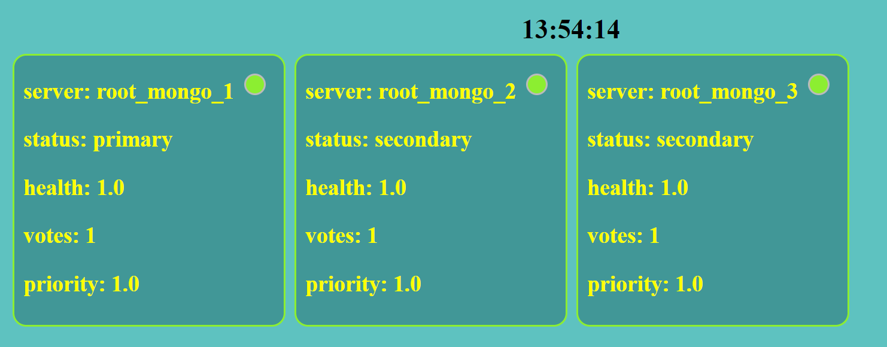

# mongoWeb
create a mongo replica with number of nodes you want and create a monitor website with flask that show their status

## run example
```
./run.sh 3 # will create mongo replica with 3 nodes
```
and then you just surf to your ip address at port 80 to see the monitor website

